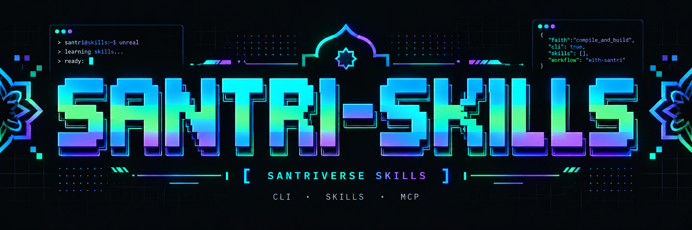

<p align="center">
  
</p>

<h1 align="center">Santriverse Skills</h1>

<p align="center">
  
  
  <a href="LICENSE"></a>
  
</p>

CLI tanpa dependency runtime untuk memasang koleksi **Google Apps Script Skills** dan **Pedoman Monorepo Santriverse** ke Google Antigravity sebagai Agent Skills atau MCP server. Katalog bawaan berasal dari [`registry.json`](registry.json). Pengguna juga dapat memasang katalog lokal terverifikasi sendiri melalui `SANTRI_SKILLS_REGISTRY`; URL katalog jarak jauh sengaja belum diterima sampai tersedia signature/pinning agar daftar perintah MCP tidak menjadi celah supply-chain.

## Prasyarat

- Node.js **18.17 atau lebih baru**
- Git
- Koneksi internet saat katalog perlu diunduh atau diperbarui
- Google Antigravity untuk memakai skill hasil instalasi

## Instalasi

> **Status npm:** paket `santriverse-skills` belum dipublikasikan ke npm. Perintah registry seperti `npm install -g santriverse-skills` dan `npx santriverse-skills` belum dapat digunakan sampai rilis npm pertama tersedia.

### Dari source — direkomendasikan saat ini

```bash
git clone https://github.com/askiya/SANTRI-SKILLS.git
cd SANTRI-SKILLS
npm install
node bin/cli.js install
```

`npm install` menyiapkan checkout lokal; CLI ini tidak memiliki dependency runtime. Untuk menyediakan perintah `santriverse-skills` secara lokal:

```bash
npm link
santriverse-skills --help
```

Tanpa clone permanen, jalankan paket langsung dari GitHub:

```bash
npx github:askiya/SANTRI-SKILLS install
```

### Setelah paket tersedia di npm

Perintah berikut baru berlaku setelah paket benar-benar dipublikasikan:

```bash
# Jalankan tanpa instalasi global
npx santriverse-skills install

# Atau instal global
npm install --global santriverse-skills
santriverse-skills install
```

## Dashboard lokal

Dashboard menyediakan pemilihan skill dan MCP lewat browser:

```bash
node bin/cli.js dashboard
# Setelah rilis npm: npx santriverse-skills dashboard
```

Buka `http://127.0.0.1:4173`. Port dapat diganti:

```bash
node bin/cli.js dashboard --port=5173
```

Dashboard hanya bind ke loopback `127.0.0.1`. Biarkan terminal berjalan selama dashboard dipakai; tekan `Ctrl+C` untuk berhenti.

## Menambah repo skill dan MCP sendiri

Katalog bawaan hanya memuat dua repo Santriverse. Untuk menghubungkan repo lain atau MCP server pilihan Anda, salin `registry.json`, tambahkan entri, lalu jalankan CLI dengan env `SANTRI_SKILLS_REGISTRY`.

```json
{
  "sources": [
    {
      "id": "skills-tim",
      "label": "Skills Internal Tim",
      "repo": "akun/REPO-SKILLS",
      "branch": "main",
      "skillsDir": "skills",
      "docsDirs": ["docs"]
    }
  ],
  "mcpServers": [
    {
      "id": "playwright",
      "label": "Playwright MCP",
      "description": "Automasi browser",
      "command": "npx",
      "args": ["-y", "@playwright/mcp@latest"]
    }
  ]
}
```

```bash
SANTRI_SKILLS_REGISTRY=/path/katalog-saya.json node bin/cli.js dashboard
```

Dashboard menampilkan seluruh skill dan MCP dari katalog itu, dan tombol install menulis ke Antigravity sesuai scope pilihan. Validasi menolak id/repo/path tidak aman, perintah dengan metakarakter shell, duplikasi id, serta entri yang memuat token atau kredensial. Entri MCP asing di `mcp_config.json` tidak pernah ditimpa; tabrakan nama menjadi error.

## Perintah CLI

```bash
node bin/cli.js install       # Pasang Agent Skills
node bin/cli.js update        # Ambil ulang sumber dan perbarui instalasi
node bin/cli.js list          # Tampilkan katalog skill
node bin/cli.js mcp-install   # Daftarkan MCP server santri-skills
node bin/cli.js mcp-serve     # Jalankan MCP server melalui stdio
node bin/cli.js dashboard     # Buka dashboard localhost
node bin/cli.js uninstall     # Hapus instalasi yang dikelola CLI
```

Semua contoh `node bin/cli.js ...` dapat diganti dengan `santriverse-skills ...` setelah `npm link`, atau `npx santriverse-skills ...` setelah paket tersedia di npm.

Opsi:

| Opsi | Nilai | Fungsi |
|---|---|---|
| `--scope` | `project` atau `global` | Tentukan target instalasi |
| `--sources` | `appscript,monorepo` | Pilih sumber dari `registry.json` |
| `--yes` | — | Mode noninteraktif; default scope `project` |
| `--force` | — | Timpa folder skill bernama sama |
| `--port` | nomor port | Port dashboard; default `4173` |
| `--help` | — | Tampilkan bantuan |
| `--version` | — | Tampilkan versi CLI |

Contoh CI/noninteraktif:

```bash
node bin/cli.js install --scope=project --sources=appscript,monorepo --yes
node bin/cli.js update --scope=global --yes
```

## Scope dan lokasi instalasi

| Scope | Agent Skills | Konfigurasi MCP |
|---|---|---|
| `project` | `<project>/.agents/skills/` | `<project>/.agents/mcp_config.json` |
| `global` (IDE) | `~/.gemini/config/skills/` | `~/.gemini/config/mcp_config.json` |
| `global` (CLI) | `~/.gemini/antigravity-cli/skills/` | memakai konfigurasi global |

Gunakan `project` untuk isolasi per repository. Gunakan `global` jika skill perlu tersedia bagi seluruh project Antigravity milik pengguna saat ini. Reload Antigravity setelah `install`, `update`, atau `mcp-install`.

Folder asing tidak dihapus atau ditimpa secara default. `uninstall` hanya menghapus folder yang memiliki marker `.santri-skills.json`. Perubahan konfigurasi MCP membuat backup `mcp_config.json.bak`.

## Mode MCP

```bash
node bin/cli.js mcp-install --scope=project
```

Installer menambahkan entry `santri-skills` tanpa menghapus MCP server lain. MCP lokal menyediakan:

| Tool | Fungsi |
|---|---|
| `list_skills` | Daftar skill dan deskripsinya |
| `get_skill` | Baca isi lengkap satu `SKILL.md` |
| `search_docs` | Cari Markdown dari dua repository sumber |

Katalog MCP terbatas pada sumber dalam [`registry.json`](registry.json):

- [`askiya/GOOGLE-APPSCRIPT-SKILLS`](https://github.com/askiya/GOOGLE-APPSCRIPT-SKILLS)
- [`askiya/MONOREPO-SKILLS`](https://github.com/askiya/MONOREPO-SKILLS)

## Workflow pembaruan

### Isi skill berubah

Tidak perlu merilis paket npm.

1. Edit dan push skill ke repository sumber.
2. Jalankan `node bin/cli.js update` pada instalasi pengguna.
3. Reload Antigravity.

`update` mengambil branch `main` terbaru dari sumber terpilih lalu memasangnya kembali ke scope tujuan.

### Kode CLI berubah

Perubahan installer, dashboard, MCP server, atau metadata paket memerlukan rilis baru:

1. Ubah kode dan test.
2. Naikkan versi di `package.json`.
3. Verifikasi dengan `npm test` dan `npm pack --dry-run`.
4. Buat tag/release GitHub.
5. Jalankan `npm publish` setelah akses registry dan nama paket siap.

Sebelum langkah 5 selesai, dokumentasi dan pengguna harus tetap memakai clone source atau spec GitHub `npx github:askiya/SANTRI-SKILLS`.

## Keamanan dan batasan

- Tinjau repository sumber sebelum instalasi. Skill dan dokumen jarak jauh adalah instruksi bagi agent, sehingga sumber yang disusupi dapat membawa instruksi berbahaya atau prompt injection.
- `update` mengambil konten branch `main`, bukan commit yang dipin. Hasil dapat berubah tanpa perubahan versi CLI.
- `--force` dapat menimpa folder bernama sama. Gunakan hanya setelah memeriksa target dan menyimpan perubahan lokal.
- Scope `global` memengaruhi semua project pengguna. Pilih scope `project` untuk membatasi dampak.
- MCP membaca katalog yang di-cache dari sumber terdaftar; ini bukan sandbox dan bukan mekanisme verifikasi tanda tangan konten.
- Dashboard tidak memakai autentikasi, tetapi hanya listen di `127.0.0.1`. Jangan mem-proxy atau mengekspos port ke jaringan yang tidak tepercaya.
- Backup MCP hanya satu file `.bak`; simpan backup terpisah sebelum perubahan penting.
- CLI tidak meminta API key. Jangan menaruh secret di skill, dokumen, argumen CLI, atau konfigurasi yang masuk version control.

## Development

```bash
npm install
npm test
node bin/cli.js list
npm pack --dry-run
```

## Lisensi

[MIT](LICENSE)
